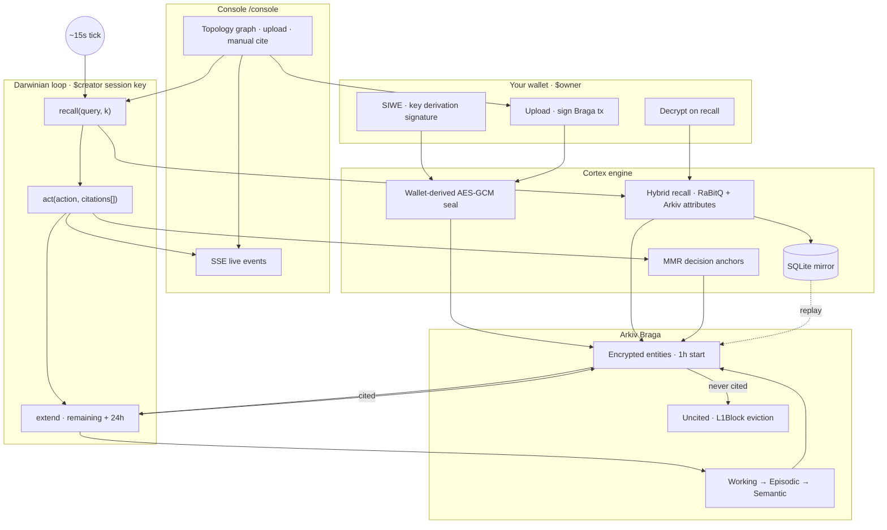

# Cortex

> **Darwinian memory for AI agents** — observations that earn longer expiration when
> cited; useless ones decay for free on Arkiv. Encrypted at rest with a key derived
> from your wallet. _(AI + Privacy · Arkiv × ETHNS Builder Challenge)_

| | Link |
|---|------|
| **Deploy (Vercel)** | https://cortex-arkiv.vercel.app |
| **Console** | https://cortex-arkiv.vercel.app/console |
| **Source** | https://github.com/LingSiewWin/Cortex |
| **Chain** | [Arkiv Braga testnet](https://explorer.braga.hoodi.arkiv.network/) · chainId `60138453102` |

---

## What it does

| Layer | Behavior |
|--------|----------|
| **Write** | RaBitQ-compress embeddings (1536-d → ~198 B), seal payload with wallet-derived AES-256-GCM, `createEntity` on Braga with **1 h** starting expiration |
| **Recall** | Hybrid search: Arkiv attributes + local mirror + RaBitQ distance — no vector DB |
| **Reinforce** | Every `act(..., citations=[...])` fires **accumulative** `extend` (remaining lease + 24 h), so useful memories grow; stale ones evict via L1Block |
| **Prove** | Merkle Mountain Range over decisions; roots **anchored on Arkiv** |

Agent surface: **`recall(query, k)`** and **`act(action, citations[])`** only.

### Live console (`/console`)

An autonomous loop (server session key) recalls and cites on a timer; each step emits typed events on **`/sse`**. The UI shows Braga tx links, topology graph, and manual query/cite. **File upload** uses your **browser wallet** on Braga (prepare on server → sign tx in MetaMask).

---

## Quick start

```bash
git clone https://github.com/LingSiewWin/Cortex.git
cd Cortex
bun install
cp .env.example .env
```

Fill `.env` (see [Environment](#environment)). Then:

```bash
bun run faucet-check    # session key has GLM on Braga
bun run seed            # seed memories (run once, before the loop)
bun run dev             # http://localhost:3000  →  /console
```

| Script | Purpose |
|--------|---------|
| `bun run dev` | Next.js dev server (landing + console + `/api/*`) |
| `bun run dev:bun` | Legacy Bun HTML-import server (`src/ui-server.ts`) |
| `bun run build` / `start` | Production Next.js |
| `bun test` | Full test suite (353+ tests) |
| `bun run smoke` | Single real Braga create + read |
| `bun run mirror` | Standalone mirror replay daemon |
| `bun run mcp` | Cortex MCP server (stdio) |
| `bun run build:plugin` | Bundle Claude Code plugin to `cortex-plugin/dist/` |

> Run **`seed` before** starting the loop — seed and the autonomous agent share one session-key EOA; parallel writes collide on nonce.

---

## Environment

| Variable | Required | Role |
|----------|----------|------|
| `SESSION_KEY_PRIVATE_KEY` | Writes / loop | `$creator` session-key EOA (fund via [faucet](https://braga.hoodi.arkiv.network/faucet/)) |
| `USER_PRIMARY_ADDRESS` | Ownership | `$owner` primary EOA |
| `CORTEX_USER_SIGNATURE` or `CORTEX_USER_PRIVATE_KEY` | Sealed recall | Wallet-derived payload key (see `bun scripts/derive-user-signature.ts`) |
| `OPENROUTER_API_KEY` or `COHERE_API_KEY` | Embeddings | 1536-d vectors for RaBitQ (upload + recall) |
| `ANTHROPIC_API_KEY` | Optional | Semantic distillation |
| `NEXT_PUBLIC_WALLETCONNECT_PROJECT_ID` | Optional | Reown AppKit modal; omit → injected MetaMask only |
| `NEXT_PUBLIC_BRAGA_RPC` | Optional | Default: Braga HTTP RPC from `src/constants.ts` |
| `CORTEX_MIRROR_PATH` | Optional | SQLite mirror path (default `./cortex-mirror.sqlite`) |

Never commit `.env`. See `.env.example` for the full list.

---

## Architecture

How Cortex fits together — wallet roles, write/recall/reinforce, and decay on Arkiv. Renders on GitHub or [mermaid.live](https://mermaid.live).



**Ownership:** `$creator` = session key (attribution); `$owner` = your wallet (extend/update/delete). Reads filter by creator + `project=cortex-ethns-2026`.

**Extend math:** `newBtl = remaining + reinforcement` (strict increase — naïve `+24h` reverts when remaining > 24 h).

---

## Stack

- **Web:** Next.js 15 (App Router), React 19, Reown AppKit, wagmi, viem
- **Runtime:** Bun (tests, scripts, plugin); Node on Vercel (API + `better-sqlite3`)
- **Chain:** Arkiv Braga — chainId `60138453102`, SDK `@arkiv-network/sdk` ^0.6.8
- **Compression:** RaBitQ @ 1536-d
- **Identity:** EIP-712 session auth, SIWE, ERC-5267 domain, browser-signed Braga writes

---

## Repo map

| Path | Contents |
|------|----------|
| `app/` | Next.js routes: `/`, `/console`, `/api/[[...path]]`, `/sse` |
| `lib/web/` | AppKit providers, connect gate, browser upload hook |
| `ui/` | Landing, console, MemoryGraph, upload UI |
| `src/lib/` | Arkiv client, crypto, sealing, Braga preflight |
| `src/compression/` | RaBitQ + embeddings + document payloads |
| `src/darwinian/` | extend, recall, citation, distill |
| `src/mirror/` | SQLite schema, replay, MMR, anchor, evict watcher |
| `src/topology/` | Graph builder for `/api/topology` |
| `src/api/` | HTTP handlers (auth, store-file, seed, …) |
| `src/agent/` | Autonomous loop, anchor worker |
| `src/mcp/` | MCP server for agent tooling |
| `src/obsidian/` | Vault → mirror sync |
| `cortex-plugin/` | Claude Code plugin (hooks, MCP, skills) |
| `scripts/` | seed, demo-flow, sovereignty-proof, plugin build |
| `tests/` | Offline + smoke/canary against Braga |
| `contracts/` | `CortexRegistry.sol`, `SynapticMarket.sol` |

---

## Claude Code plugin

Install from `cortex-plugin/` (after `bun run build:plugin`):

- **Hooks:** capture before compaction, recall at session start
- **MCP:** Cortex memory tools on stdio
- **Skill:** `cortex-memory` usage patterns

Config templates: `cortex-plugin/.mcp.json`, `hooks/hooks.json`.

---

## Deploy (Vercel)

**Production:** https://cortex-arkiv.vercel.app  
**Console:** https://cortex-arkiv.vercel.app/console

```bash
bun run build
```

Set env vars in the Vercel project (same as local). `vercel.json` pins **Next.js** + `outputDirectory: dist` (must match `distDir` in `next.config.ts`). Landing video copies from `assets/` during `bun run build`.

If a deploy **fails**, production stays on the last **Ready** build — check the Vercel dashboard or `vercel ls`. A green build log is not enough; the deployment must finish without the “output directory not found” error.

Background workers (`CORTEX_AUTONOMOUS_LOOP`, anchor drain, evict watcher) are **off** on Vercel unless `CORTEX_START_WORKERS=1`. The console UI and browser-signed uploads still work on the hosted URL.

---

## Sovereignty proof

```bash
bun scripts/sovereignty-proof.ts
```

Kill backend → wipe local mirror → rebuild from **public** Arkiv RPC with **only** your wallet → recall decrypts; without the wallet, ciphertext stays unreadable.

Example Braga round-trip: [explorer tx](https://explorer.braga.hoodi.arkiv.network/tx/0x6c391af1fa9f9faa952b793980e2b657b33d724298b15a4b7e5fc174543828a2).

---

## Troubleshooting

| Symptom | Fix |
|---------|-----|
| Upload stuck on “Storing…” | Switch wallet to Braga; fund GLM ([faucet](https://braga.hoodi.arkiv.network/faucet/)); check `OPENROUTER_API_KEY` / `COHERE_API_KEY` |
| `embedText: … API key` | Set embedding provider in `.env` |
| `extend reverted: newBtl <= currentBtl` | Use accumulative extend in `src/darwinian/extend.ts` |
| Stuck nonce on Braga | Cancel/speed up pending tx in wallet |
| Smoke test hangs | `bun run faucet-check`; fund session key |
| API 500 on Vercel | Mirror/workers need SQLite — use local `bun run dev` for full autonomous loop |

**Braga links**

- Explorer: https://explorer.braga.hoodi.arkiv.network/
- Faucet: https://braga.hoodi.arkiv.network/faucet/
- RPC: `https://braga.hoodi.arkiv.network/rpc`

---

## Security (public deployment)

`/api/citation/manual` and `/api/loop/control` are **unauthenticated** on the hosted URL for frictionless exploration (spend guard + rate limits only). For production, gate writes behind the SIWE `cortex_session` cookie and cap session-key funding.

---

## License

MIT — see [`LICENSE`](./LICENSE).
